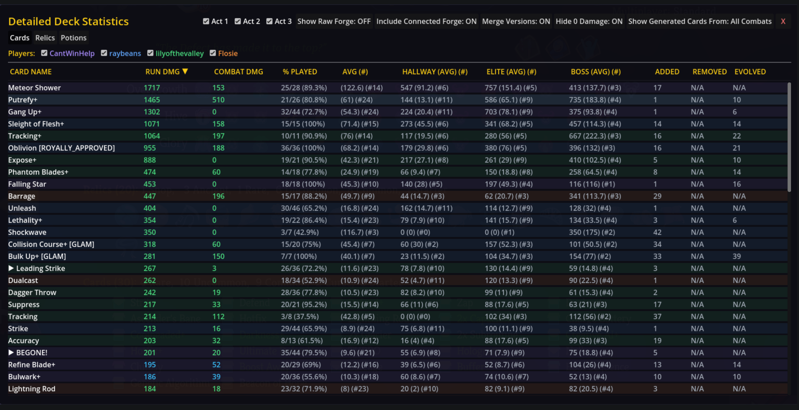
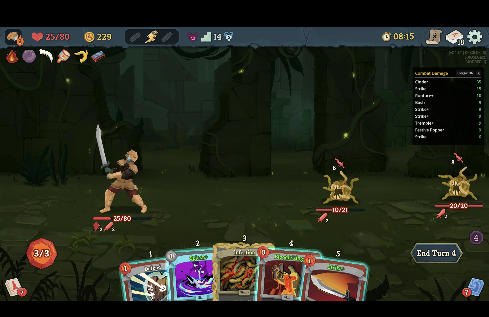

# Deck Tracker
A utility mod that helps quantify damage output by recording individual damage contribution from cards, relics, and potions. 

The mod does not modify gameplay, so it can be installed for only one person in multiplayer. 

Damage for the current run is shown in the in-game overlay.
Entity damage tracking is also accumulated per fight, per run in `deck_tracker_exports/card_fights.csv`.
I plan to make a website to receive statistic uploads to aggregate everything in the future.

## Controls

### Hotkeys
* `[` to show / hide the small UI
* `]` to show / hide the full screen UI
* `\` to toggle to very debug mode for the mod's logs (unnecessary)

### Full Screen UI Explanation
* The top left has 3 tabs: Cards, Relics, and Potions
* Below that, in multiplayer, there are checkboxes to show/hide entries from each specific player
* Each column can be used to sort by clicking on the column header. Defaulted to sort by Run DMG
  
| Column Name                | Explanation                                                                                    |
|----------------------------|------------------------------------------------------------------------------------------------|
| Card Name                  | The name of the card, with any enchantments in [Square Brackets]                               |
| Run DMG                    | The total damage the card has contributed throughout the run                                   |
| Combat DMG                 | The total damage the card has contributed this combat                                          |
| % Played                   | # Times Played / # Times Drawn (% Played)                                                      |
| Run AVG (#)                | Run damage average across all combats (# combats encountered)                                  |
| Hallway/Elite/Boss AVG (#) | Run damage average across all hallway/elite/boss combats (# type-specific combats encountered) |
| Added                      | The floor the card was added                                                                   |
| Removed                    | The floor the card was removed via card remove                                                 |
| Evolved                    | The floor the card was upgraded / enchanted / transformed                                      |

* The relic/potion tabs have less and similar columns which are mostly self-explanatory.
* The top bar has various other buttons
  
| Button                           | Explanation                                                                                                                       |
|----------------------------------|-----------------------------------------------------------------------------------------------------------------------------------|
| Act 1 / Act 2 / Act 3 Checkboxes | Includes / excludes data specific to Act 1, 2, 3                                                                                  |
| Show Raw Forge                   | Overrides the Run DMG and Combat DMG column to show Run Forge and Combat Forge                                                    |
| Include Connected Forge          | Whether to route forge damage off from the Sovereign Blade into the cards that forged it. Disabled while Show Raw Forge is active |
| Merge Versions                   | Whether to merge the entries for the same card that was upgraded/enchanted together                                               |
| Hide 0 Damage                    | Whether to hide cards that have contributed 0 damage                                                                              |
| Show Generated Cards From:       | The scope of generated cards to include in drop downs                                                                             |
| X                                | Closes the UI                                                                                                                     |

## Attribution Methods

### General
* Damage dealt to block is counted as damage
* Overkill damage is not counted
* Direct damage is attributed to the entity that dealt the damage (e.g. Strike, Inferno, Fire Potion)
* Additive and multiplicative damage modifiers get their credit (e.g. Accuracy, Strike Dummy, Patter, Tracking, Flanking, Pen Nib, Gigantification Potion)
* AOE enablers like Fan of Knives or Seeking edge get credit for the extra hits they add, while the largest individual hit is attributed to the base card

### Vulnerable
* Cards that apply vulnerable get the extra damage from vulnerable, in a first in, first out manner (e.g. card A applies  vulnerable,
  then card B applies another 1 vulnerable -- on turn 1, card A gets extra damage from vulnerable, then on turn 2, card B gets the extra damage)
* Cruelty and debilitate get the extra damage they add to vulnerable

### Poison
* Poison is attributed proportionally based on shares, so you may see decimals 

For example, card A applies 5 poison, card B applies 7 poison. The total is 12 shares of poison
On turn 1, card A gets 5/12 * 12 = 5 damage, card B gets 7/12 * 12 = 7 damage. 
1 poison decrements on turn end. 

Card A loses 5/12 * 1 = 0.417 shares, so it has 4.583 shares left. Card B loses 7/12 * 1 = 0.583
shares, so it has 6.417 shares left. The total is still 11 shares. 

When the poison ticks again, Card A gets 4.583/11 * 11 = 4.583 damage.
Card B gets 6.417/11 * 11 = 6.417 damage.

### Forge
* Forge cards get damage for their forge amounts when the Sovereign Blade deals damage 
* Forge is handled in a queue manner, where the first forgers get credit first in the event of overkill (with the base 10 being given to the Sovereign Blade card itself) 

### Doom
* Doom only counts for damage if the doom animation plays and kills the enemy
* Doom is attributed in order of the entities that applied the doom, with the earlier cards getting damage first
in the event of overkill

### Orbs
* Orb passive damage goes to the entity that channeled the orb
* Extra passive procs from Darkness, Tesla Coil, Loop, or Gold Plated Cables are attributed accordingly
* The damage from the first orb evoke goes to the original channeler. Further evokes are given to the card that added the extra proc
  (e.g. Dual Cast, Shatter, Multicast).
* Extra damage from focus is attributed to the entities that applied the focus (e.g. Hotfix, Defragment, Data Disk)
* Extra damage on lightning orbs from Infused Core is also attributed accordingly

### Card Generation
* Card generators get damage for the cards that they generate (e.g. Blade Dance, Infernal Blade, Spectrum Shift)
They are added in a dropdown and can be revealed or hidden by pressing on the dropdown arrow.
* Card generation is handled in a tree-like manner, so cards that generate cards that generate cards are all linked back to the root
* Possible future improvement: If a card that generates multiple tokens like Blade Dance is played, even if only 1 token is played, the UI will stack them immediately (it will show Shiv x3) 
* Combat generated copies from Anger, Adaptive Strike, Dual Wield, Music Box, etc... are considered the same card

## Limitations

* Added damage from Slow from Bygone Effigy is attributed to the card dealing the damage
* Accelerant does not get any credit for the double proc of poison
* Replay / forced play is attributed to the base card, not the card that added plays (e.g. Echo Form, Knife Trap, Tag Team, Soldier's Stew)
* Entities that upgrade cards mid-combat do not get credit for the upgraded card (e.g. Razor Tooth, Armaments). Any extra
damage from the upgraded card is given to the base card.
* Damage lost from minus focus (e.g. Biased Cognition, Hyperbeam), minus strength (Friendship, Shared Fate) are not tracked anywhere,
the affected cards will simply appear to do less damage
* Potion generation is not tracked (e.g. Petrified Toad, Alchemize, Entropic Brew, Delicate Frond, etc...)

## Future Plans
* Create a website to upload statistics and accumulate them
* Address some of the limitations
* Fix any bugs / add unwired damage attribution methods (Please report any you notice!)
* Expand to track block